 

I'm an apprentice **Application Developer EFZ** in 🇨🇭 Switzerland — started in August 2023, now in my
**final year** and working as an intern. I like building across the whole stack, from the database schema
to the last pixel of the UI.

 

 

  

 

### 🚀 Featured

| Project | What it is | Stack |
|---|---|---|
| [**cram**](https://github.com/philklunder/cram) | Exam-prep app — turns your material into spaced-repetition flashcards | Swift · FastAPI · Claude |
| [**BudgetTracker**](https://github.com/philklunder/BudgetTracker) | Desktop app to track income and expenses | C# · WPF |
| [**RecipeBook**](https://github.com/philklunder/RecipeBook) | My very first website — a recipe book | HTML · CSS · JavaScript |

 

### 🌹 Activity

<picture>
  <source media="(prefers-color-scheme: dark)" srcset="https://raw.githubusercontent.com/philklunder/philklunder/output/snake-dark.svg"/>
  <source media="(prefers-color-scheme: light)" srcset="https://raw.githubusercontent.com/philklunder/philklunder/output/snake.svg"/>
  
</picture>

Hand-made animated SVGs · contributions refreshed daily by a GitHub Action

